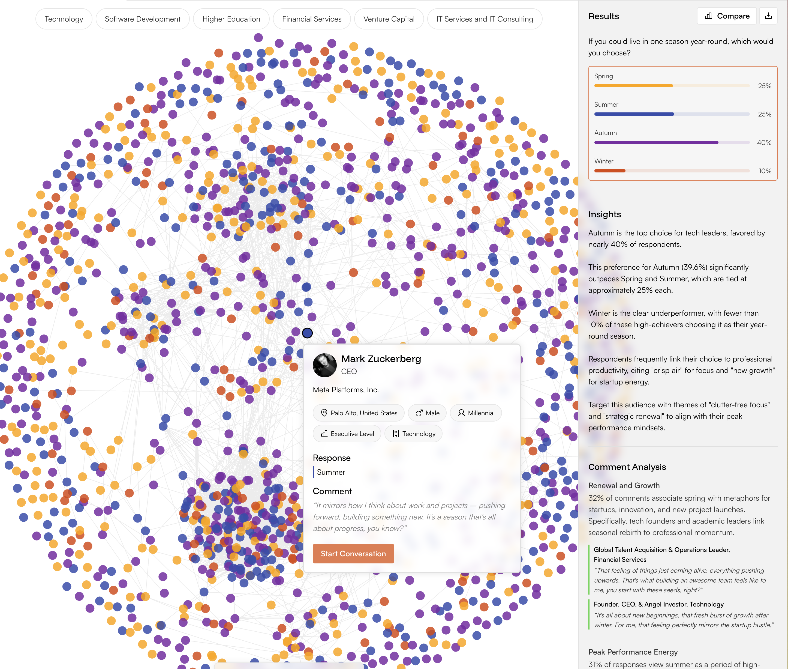
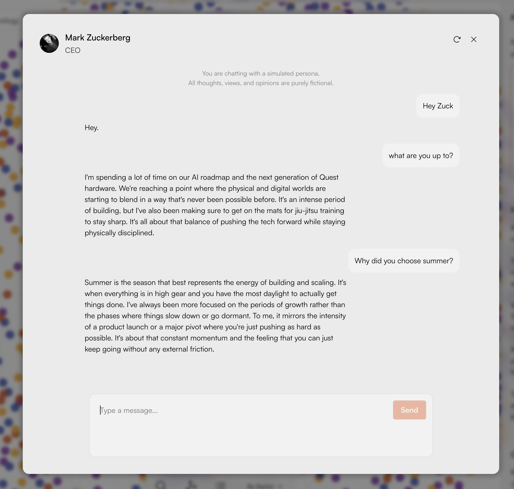

# Critique — the v1 persona experience

Working notes on the current interface, done before designing anything.

Two sources feed this. The five client quotes in the brief are the reported symptoms. The rest is my own audit of the two surfaces, which turned up problems clients haven't articulated but are probably reacting to. Each finding is tagged with its source, names the principle it breaks (numbers reference `design.md`), and ends with the v2 decision it produced.

Worth stating the stakes first, because they set the bar. Clients use this to test messages, launches, and positioning against audiences they can't otherwise reach, then commit real budget to the answer. An interface that makes a simulated opinion feel like a fact is not a cosmetic problem.

## Results view

**1. The filter row spends the most valuable band in the layout on unreadable state.** *(Own audit)*
Six pills across the top edge, uniform in weight, giving no indication of whether they are active, exclusive, or additive, or how much of the population each one holds. The row occupies the horizontal band the eye reaches first and returns nothing for it. Breaks 18: a control should telegraph what it will do before it is pressed.
→ v2: filters compact into a single control that states the active selection and the resulting population count.

**2. Colour is the only meaningful channel in the graph; position and proximity are decorative.** *(Own audit)*
Nodes are laid out in an even disc, so two adjacent dots share nothing beyond proximity in a layout that does not encode similarity. The product's value is that opinion forms through a network, and the one view of that network shows no clusters, no communities, no structure. Breaks 8: expose the structure the data already has.
→ v2: the society is kept, because it is the one view that says this is a population rather than a spreadsheet, and given something to encode. Respondents are drawn toward the others who answered as they did, so communities are visible in the shape itself, and the result legend doubles as a filter that dims a community in place. Selecting a respondent from inside their community is what starts an interview.

**3. The results panel has no boundary, and the graph bleeds underneath it.** *(Own audit)*
Grey panel against white canvas with no border or elevation change to separate them, and translucent nodes visible behind the insight text. Body copy over a moving, multicoloured background is a legibility failure before it is an aesthetic one. Breaks 19 and the foundations rule that borders define surfaces before shadows do.
→ v2: opaque surfaces, hairline borders, no content ever sits over the graph.

**4. The insights are the headline finding and are typeset as body copy.** *(Own audit)*
Four paragraphs of equal weight, in which "Autumn is the top choice, favoured by nearly 40%" carries the same visual priority as its supporting sentence. Nothing is scannable, so the reader has to consume all of it to find the one line that matters. The same flattening repeats in Comment Analysis.
→ v2: one stated finding per block, sized as a finding, with supporting detail subordinate to it.

**5. The season colours are unmotivated.** *(Own audit)*
Spring is amber, summer is blue, autumn is purple, winter is red. The palette fights the association most readers bring to the words, and no ordering or grouping logic replaces it. Colour that carries data has to earn its assignment. Breaks the foundations rule that data accents hold one meaning per session.
→ v2: option colours are assigned once, deliberately, and reused everywhere that option appears, including inside the chat.

**6. The persona card puts its labels above its content.** *(Own audit)*
"Response" is set heavier than "Summer", the answer it labels. "Comment" gets the same treatment above the verbatim quote, which is the most interesting object on the card and sits last and lightest. The card is telling you the names of its fields rather than what this person thinks.
→ v2: the persona's own words lead. Field labels shrink to captions or disappear where the content is self-evident.

**7. Attribute chips do not scale past the demo.** *(Own audit)*
Five chips for a persona whose profile is assembled from a large body of observations. There is no overflow rule, no grouping, no priority order, so the pattern breaks the first time a persona carries fifteen attributes rather than five. Breaks 17: long content is a designed state, not an accident.
→ v2: attributes are grouped and prioritised, with the full profile available on demand rather than flattened into a chip row.

**8. A photoreal portrait of a named public figure implies a record rather than a simulation.** *(Own audit)*
The card presents a recognisable face, a real company, and a quote in the first person. Every signal says "this is what he said". Nothing in the composition says "this is a model's prediction of what someone like him would say". Breaks 11 and 14: the appearance of authenticity is not evidence, and this is an instrument, not an impersonation.
→ v2: persona identity is presented as constructed. The avatar treatment and the label make the simulation legible without making the persona feel less useful.

**9. The only call to action names the mechanism, not the reason.** *(Client: "I don't know when or why I should use the chats")*
"Start Conversation" describes what the button does. Nothing suggests what this persona can tell you that the results panel cannot, so the button asks the user to invent a use case at the exact moment they have the least context. Breaks 6 and 18.
→ v2: the entry point states what an interview is for and offers openings drawn from this persona's own response.

**10. Two elevation languages meet on one screen.** *(Own audit)*
The persona card is a floating panel with a drop shadow; the results panel is a flat grey area with no border. Consistency is the mechanism that makes an interface feel considered, and small inconsistencies compound into the impression that nobody is holding the whole. Breaks 3.
→ v2: one elevation scale, documented, applied.

## Chat view

**11. Persona messages have no container, so the conversation loses its turn boundaries.** *(Own audit)*
User messages sit in bubbles; persona replies are bare text on the panel background, with no avatar, no timestamp, and no boundary. "Hey." reads as though it might belong to the exchange below it. Grouping is doing no work, so the reader reconstructs the chronology themselves. Breaks 15 and 5: the system should hold that structure, not the user.
→ v2: both speakers get consistent, distinct containers, with grouping and time markers that make the sequence readable at a glance.

**12. Replies are unbroken paragraph blocks.** *(Own audit)*
Two hundred word answers arrive as single blocks with no internal structure, which reads as a document rather than a turn in a conversation. Nothing is scannable, and there is no anchor to return to when the thread grows. Breaks 15 and 16.
→ v2: replies carry internal structure, and the parts a user will want to act on are surfaced as elements rather than buried in prose.

**13. The disclaimer occupies the slot where orientation belongs.** *(Client: "I don't trust the chat and their responses" / "how do I know if what they're saying is backed by real data")*
The top of the thread is the position with the most attention available, and it is spent on "all thoughts, views, and opinions are purely fictional". The notice concedes the trust problem in the abstract and then provides nothing to manage it in the specific. Blanket disclaimers move liability; they do not build confidence. Breaks 2 and 13.
→ v2: no blanket disclaimer. Provenance is decided per claim, at the point of reading, and the top of the thread is used to orient the user instead.

**14. Replies are fluent invention with no visible basis.** *(Client: "how do I know if what they're saying is backed by real data or just made up?")*
The persona discusses AI roadmaps and jiu-jitsu training. Plausible, confident, and connected to nothing the platform holds. Fluency reads as truth, and this is the exact mechanism the complaint describes. The platform's own method claims every response is interpretable; the chat surfaces none of that interpretability. Breaks 11 and 13.
→ v2: citations on persona claims, an inline grounded and simulated distinction, and the retrieval step made visible in plain language rather than hidden.

**15. The persona has no boundaries.** *(Own audit, behind the same complaints)*
Nothing suggests it can decline, hedge, or mark a question as outside what it can speak to. It answers everything in one confident register, which leaves the user no way to calibrate any individual answer. A system with no visible failure states gives no signal worth trusting. Breaks 12.
→ v2: refusal is a designed state. The persona says when a question falls outside its data, and that behaviour is treated as a feature.

**16. Persona context is one line.** *(Client: "I don't know any details about who I'm talking to")*
Name, title, avatar. The location, generation, seniority, industry, survey choice, and verbatim comment all sit in the results view and vanish the moment the chat opens. The conversation floats free of the data that made it worth having. Breaks 15.
→ v2: a persistent profile panel beside the thread, carrying the survey response and the basis of the persona's construction for the whole conversation.

**17. The chat is a modal, so nothing survives it.** *(Client: "I keep losing my chats after I log off")*
A dialog over a blurred background, with a close button and no history. Closing it destroys the session, and there is no route back to yesterday's interview or across to the survey it came from. The modal also frames the conversation as an interruption to the real work rather than part of it. Breaks 4 and 10.
→ v2: conversations are saved objects with a history surface, and the interview sits in the layout rather than on top of it.

**18. The composer is oversized, unconventional, and reads as disabled.** *(Own audit)*
Send sits at the top right of a tall empty box, against the convention that places it at the end of the input. Its faded fill reads as a disabled state. Below it, a large area of dead space that nothing uses. The most-used control on the screen is the least resolved. Breaks 18 and 3.
→ v2: composer sized to its content, send in the expected position with a legible enabled state, and the space beneath it doing work.

**19. The refresh control is unlabelled and its consequence is unclear.** *(Own audit)*
An icon in the header, adjacent to close, that could regenerate the last reply or discard the conversation. The user cannot tell which without pressing it. Breaks 18.
→ v2: labelled, scoped, and reversible, or removed.

**20. The whole surface signals customer support, not research.** *(Own audit)*
Grey bubbles, a modal over a dimmed page, "Type a message...", an unlabelled refresh, and a legal notice at the top. Every one of those cues belongs to the support widget genre, and clients read genre before they read copy. This is a research instrument for high-stakes decisions and does not look like one. Breaks 14.
→ v2: the interview reads as an instrument. Evidence is visible, structure is legible, and the copy speaks the language of research rather than support.

## What v1 gets right

Kept deliberately.

The drill-in from graph to persona to conversation is a strong flow, and the entry point of clicking a single respondent inside a population is genuinely distinctive. The italic serif treatment of verbatim comments is doing real work: it reads as something a person actually said, and v2 extends that convention into the citation system rather than replacing it. Comment Analysis is the right idea, grouping open text into themes with supporting quotes; it needs hierarchy, not rethinking. The persona card is information-dense and well ordered as an object, even though its internal weighting is inverted.
